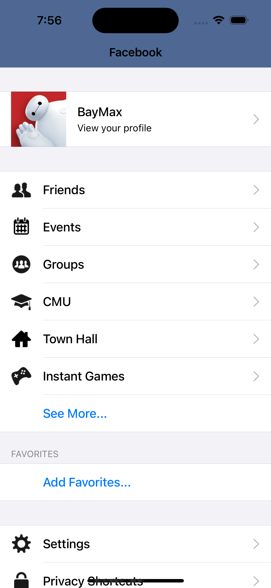
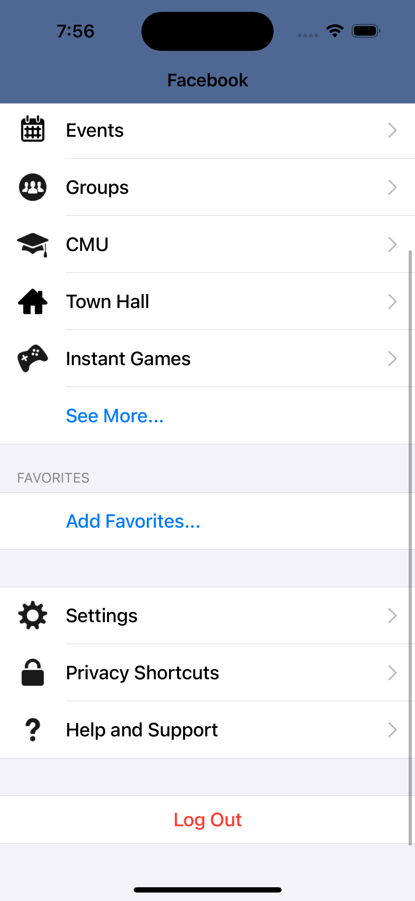

# Swift 30 Projects with SwiftUI

## FacebookMe

### Preview

Main (1)|Main (2)
:-:|:-:
|

### Issue

- NavigationBar Change BackgroundColor

``` swift
func navigationBarColors(background : UIColor?) {
    let navigationAppearance = UINavigationBarAppearance()
    
    navigationAppearance.configureWithOpaqueBackground()
    navigationAppearance.backgroundColor = background ?? .clear
    
    UINavigationBar.appearance().standardAppearance = navigationAppearance
    UINavigationBar.appearance().compactAppearance = navigationAppearance
    UINavigationBar.appearance().scrollEdgeAppearance = navigationAppearance
}
```
